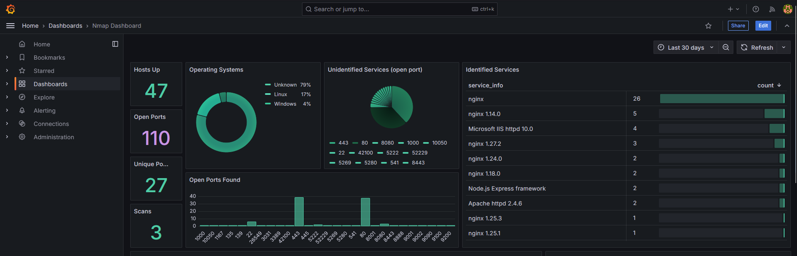

# PortWatch

PortWatch automates network scanning and provides visual analytics of scan results using Nmap, SQLite, and Grafana.

## **Overview**

This project automates regular network scanning of specified IP addresses and visualizes the results in a Grafana dashboard. It's designed to help track changes in network services and ports over time.



## **Features**

- **Automated Scanning**: Performs regular Nmap scans at configurable intervals
- **Efficient Scanning**: Uses optimized Nmap parameters for faster scanning
- **Data Persistence**: Stores scan results in SQLite database
- **Visual Analytics**: Provides real-time visualization through Grafana dashboards
- **Historical Tracking**: Maintains scan history for trend analysis
- **Docker Integration**: Fully containerized solution for easy deployment

## **Components**

- Nmap scanner for port and service detection
- SQLite database for storing scan results
- Python scripts for data processing
- Grafana for visualization
- Docker for containerization

## **Prerequisites**

- Docker and Docker Compose
- Basic understanding of networking concepts
- Linux/Windows environment with Docker support

## **Installation**

1. Clone the repository:

`git clone https://github.com/4NK1T/PortWatch/ && cd PortWatch`

1. Add target IPs to scan:

`echo "192.168.1.1" > data/targets.txt`

1. Start the containers:

`docker-compose up -d`

## **Usage**

## **Adding Target IPs**

1. Edit the **`data/targets.txt`** file:

`# Add one IP per line
192.168.1.1
10.0.0.1
example.com`

1. The scanner will automatically pick up new IPs in the next scan cycle

## **Accessing the Dashboard**

1. Open your browser and navigate to **`http://localhost:3000`**
2. Login with default credentials:
    - Username: **`admin`**
    - Password: **`admin`**
3. Navigate to the "Dashboards" Section.

## **Dashboard Features**

- **Host Count**: Total number of live hosts
- **Operating Systems**: Distribution of detected OS types
- **Open Ports**: List of open ports across all hosts
- **Services**: Breakdown of running services
- **Historical Data**: Track changes over time

## **Configuration**

## **Scan Interval**

Modify the scan interval in

```
docker-compose.yml
```
` SCAN_INTERVAL=86400  # 24 hours in seconds`

## **Nmap Parameters**

Adjust scan parameters in

```
scripts/nmap_scan.sh
```

`nmap -p- -sCV -T3 --max-retries 2 --min-rate 7500 -sS --initial-rtt-timeout 200ms -oX "$xml_file" -iL "$IPS_FILE"`


## **Limitations**

- This is a personal project and may need adjustments for production use
- Scan performance depends on network conditions and target responsiveness
- Large networks may require scan parameter optimization
- Limited to basic authentication and security features

## **Troubleshooting**

1. If scans aren't running:

`docker logs visualizer-scanner-1`

1. If database isn't updating:

`docker exec visualizer-scanner-1 ls -l /data/`

1. If Grafana shows no data:
- Verify database exists and has data
- Check datasource configuration
- Ensure proper permissions on database file

## **Personal Note**

This is a personal project created for learning and experimentation. While functional, it may not follow all best practices and security guidelines. Use at your own discretion and modify as needed for your use case.

## **Contributing**

This is a personal project, but suggestions and improvements are welcome through issues or pull requests.

## **Disclaimer**

This tool should only be used on networks and systems you have permission to scan. The author is not responsible for any misuse or damage caused by this tool.
